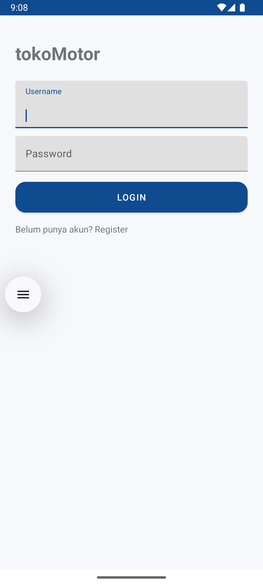

# TokoMotor 🏍️

Aplikasi Android untuk Ujian Akhir Semester - Mobile Device Programming

## 📌 Deskripsi
TokoMotor adalah aplikasi sederhana berbasis Android untuk mengelola data motor.  
Aplikasi ini memiliki fitur login/register, CRUD data motor, serta tampilan daftar menggunakan RecyclerView.

## ✨ Fitur
- Login & Register (SharedPreferences)
- CRUD (Create, Read, Update, Delete) Motor
  - Data teks (nama motor, deskripsi)
  - Data angka (harga, stok)
  - Data file/URL (gambar motor)
- Tampilan daftar dengan RecyclerView
- Splash Screen

## 🛠️ Teknologi
- Bahasa: Kotlin
- Database: SQLite
- UI: XML + RecyclerView
- Manajemen Session: SharedPreferences

## 📷 Screenshot
-LOGIN PAGE
## Screenshot


## 📂 Repository
Link GitHub: [TokoMotor_UAS](https://github.com/tpzmous/TokoMotor_UAS)

---

### 2. Tambahkan ke Git
Setelah bikin file `README.md`, jalankan di PowerShell:

```powershell
git add README.md
git commit -m "Add README.md"
