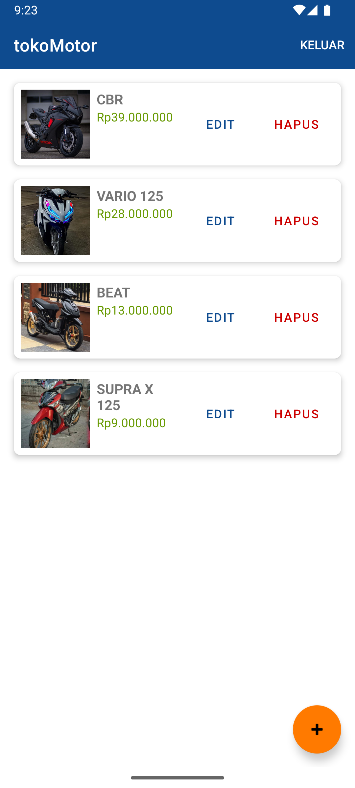
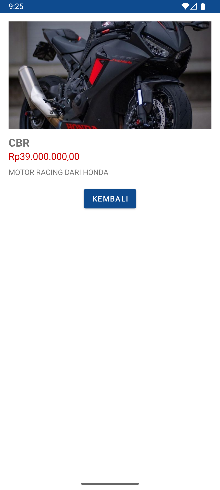

# 🏍️ TokoMotor

Aplikasi Android untuk **Ujian Akhir Semester - Mobile Device Programming**

---

## 📌 Deskripsi
**TokoMotor** adalah aplikasi sederhana berbasis Android untuk mengelola data motor.  
Aplikasi ini memiliki fitur login/register, CRUD data motor, serta tampilan daftar menggunakan RecyclerView.  

---

## ✨ Fitur
- [x] **Login & Register** (SharedPreferences)
- [x] **CRUD (Create, Read, Update, Delete) Motor**
  - [x] Data teks → *nama motor, deskripsi*
  - [x] Data angka → *harga, stok*
  - [x] Data file/URL → *gambar motor*
- [x] **Tampilan daftar dengan RecyclerView**
- [x] **Splash Screen**
- [x] **Detail Motor**

---

## 🛠️ Teknologi
- **Bahasa**: Kotlin  
- **Database**: SQLite  
- **UI**: XML + RecyclerView  
- **Session**: SharedPreferences  

---

## 📷 Screenshot

### 🔑 Login Page

  

### 📝 Register Page

  

### 🏠 Home / List Motor

  

### ➕ Add/Edit Motor

  

### 📄 Detail Motor

  

---

## 📂 Repository
🔗 [TokoMotor_UAS](https://github.com/tpzmous/TokoMotor_UAS)

---

## 👨‍🏫 Ujian Akhir Semester
- Mata Kuliah: **Mobile Device Programming**  
- Bahasa: **Kotlin**  
- Nama Mahasiswa **Aditya renanda widyatama**
- Nim **202121420007** 

